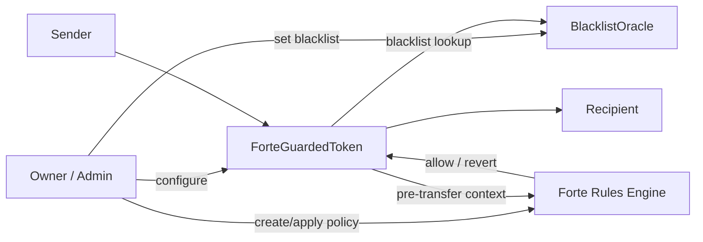

# Forte ERC20 Guard Demo

[](https://github.com/wangjunjie007/forte-erc20-guard-demo/actions/workflows/ci.yml)
[](https://github.com/wangjunjie007/forte-erc20-guard-demo/releases)
[](LICENSE)
[](https://book.getfoundry.sh/)

A practical Solidity demo that shows how to enforce **transfer caps**, **blacklist checks**, and **lockups** on an ERC20 token with **Forte Rules Engine** instead of hardcoding all compliance logic directly into the token.

> Status: **public-release ready for local demo use**  
> Validation: **12/12 Foundry tests passing** + **end-to-end integration flow passing**

---

## Why this repo exists

Most token projects eventually need some form of transfer control:

- block sanctioned or blacklisted accounts
- limit large transfers for retail users
- enforce time-based lockups or vesting windows
- keep special treasury or admin paths exempt when needed

The naive way is to hardcode those rules deep inside the ERC20 contract. That works at first, but it quickly becomes rigid and hard to reason about.

This repo demonstrates a cleaner pattern:

- keep the ERC20 readable
- move policy decisions into **Forte Rules Engine**
- keep validation reproducible with **Foundry tests** and **live integration checks**

---

## What the demo enforces

### 1) Transfer cap
Regular wallets cannot transfer more than `maxTransfer` in a single transaction.

### 2) Blacklist protection
If either the sender or recipient is blacklisted, the transfer is rejected.

### 3) Lockup enforcement
A wallet with `lockUntil[address] > block.timestamp` cannot transfer out before unlock time.

### 4) Treasury bypass
A designated treasury address can bypass cap and lockup restrictions.

---

## Architecture



### Core components

- `src/ForteGuardedToken.sol`  
  ERC20 token that forwards transfer context to Forte Rules Engine before `transfer` / `transferFrom`.

- `src/BlacklistOracle.sol`  
  Minimal on-chain oracle storing whether an address is blacklisted.

- `src/RulesEngineClientCustom.sol`  
  Integration layer used by the token to call Forte Rules Engine.

- `policy/transfer-guard.policy.json`  
  Policy definition applied to the token.

- `script/DeployDemo.s.sol`  
  Foundry deployment script for demo contracts.

- `scripts/rebuild-local-stack.sh`  
  One-command local rebuild: fresh anvil, deploy Forte Rules Engine, deploy demo contracts, create/apply policy, write `.env`, run validation.

---

## Repository layout

```text
forte-erc20-guard-demo/
├─ .env.sample
├─ CONTRIBUTING.md
├─ LICENSE
├─ NEXT_STEPS.md
├─ README.md
├─ SECURITY.md
├─ foundry.toml
├─ package.json
├─ policy/
│  └─ transfer-guard.policy.json
├─ script/
│  └─ DeployDemo.s.sol
├─ scripts/
│  ├─ apply-policy-template.ts
│  ├─ apply-policy.ts
│  ├─ assert-policy-state.sh
│  ├─ generate-integration.ts
│  ├─ integration-check.sh
│  ├─ live-check.sh
│  ├─ policy-helper.ts
│  ├─ rebuild-local-stack.sh
│  ├─ run-policy-playground.sh
│  └─ validate-policy-examples.ts
├─ src/
│  ├─ BlacklistOracle.sol
│  ├─ ForteGuardedToken.sol
│  └─ RulesEngineClientCustom.sol
├─ test/
│  ├─ ForteGuardedToken.t.sol
│  └─ MockRulesEngine.sol
├─ docs/
│  ├─ ARCHITECTURE.md
│  ├─ DEMO.md
│  ├─ POLICY_COOKBOOK.md
│  ├─ POLICY_PLAYGROUND.md
│  ├─ PUBLISHING.md
│  └─ TYPESCRIPT_HELPER.md
├─ examples/
│  ├─ deployment-summary.example.json
│  └─ policies/
│     ├─ README.md
│     ├─ lockup-and-sanctions-only.policy.json
│     ├─ retail-cap-with-treasury-bypass.policy.json
│     ├─ strict-no-exemptions.policy.json
│     └─ treasury-emergency-freeze.policy.json
└─ playground/
   ├─ app.js
   ├─ index.html
   └─ styles.css
```

---

## Prerequisites

- [Foundry](https://book.getfoundry.sh/getting-started/installation)
- Node.js 20+
- `npm`
- local shell access to `forge`, `cast`, `anvil`, `jq`

---

## Quick start

### 1. Install dependencies

```bash
npm install
forge install foundry-rs/forge-std --no-git
```

### 2. Rebuild the full local stack

```bash
npm run rebuild:local
```

What this does:

1. starts a fresh local anvil chain
2. clones / installs the Forte Rules Engine upstream dependency if needed
3. deploys the Forte Rules Engine diamond
4. deploys `BlacklistOracle` and `ForteGuardedToken`
5. creates and applies the policy
6. writes `.env`
7. runs the live validation script

---

## Verification commands

### Policy example validation

```bash
npm run check:examples
```

This validates the active policy file plus every template in `examples/policies/` so contributors can safely add new postures without breaking the cookbook.

### Unit tests

```bash
npm test
```

Current coverage includes:

- `transfer` within cap succeeds
- `transfer` over cap reverts
- sender blacklist reverts
- recipient blacklist reverts
- lockup blocks transfer until unlock
- treasury bypass works
- `transferFrom` respects the same rule set
- disabling Rules Engine falls back to raw ERC20 behavior

### End-to-end integration check

```bash
npm run check:integration
```

### Assert the applied policy on the real local Rules Engine

```bash
npm run check:policy
```

### Run only the live transfer scenario checks

```bash
npm run check:live
```

---

## Policy cookbook

Developers rarely want a single policy file — they want a set of starting postures they can fork quickly.

This repo now includes:

- `docs/POLICY_COOKBOOK.md` for posture selection and adaptation guidance
- `examples/policies/` for ready-to-copy policy templates
- `npm run check:examples` to validate the cookbook in CI

That makes the repo more useful as a reusable Forte developer on-ramp instead of just a one-off demo.

---

## TypeScript / viem helper wrapper

To expand participation beyond Solidity-only contributors, this repo now includes a TypeScript helper layer:

- `npm run policy:templates` to list available cookbook templates
- `npm run policy:apply-template -- --template <name>` to create+apply a template
- `npm run policy:apply-template -- --template <name> --create-only` to create without apply

See full usage and CLI options in `docs/TYPESCRIPT_HELPER.md`.

---

## Local policy playground

For fast posture simulation, run:

```bash
npm run playground:start
```

Then open:

- `http://127.0.0.1:4173/playground/`

This playground evaluates policy rules from cookbook JSON in-browser and shows a rule-by-rule PASS/FAIL view with final allow/revert outcome.

See `docs/POLICY_PLAYGROUND.md` for usage details.

---

## Latest local validation snapshot

The local rebuild flow writes a machine-readable summary file to `cache/deployment-summary.json`.  
A checked-in example lives at:

- `examples/deployment-summary.example.json`

Typical output looks like:

```json
{
  "network": {
    "name": "anvil",
    "chainId": 31337,
    "rpc": "http://127.0.0.1:8545"
  },
  "rulesEngine": {
    "diamondAddress": "0x8A791620dd6260079BF849Dc5567aDC3F2FdC318"
  },
  "demoContracts": {
    "blacklistOracle": "0xb7f8bc63bbcad18155201308c8f3540b07f84f5e",
    "token": "0xa51c1fc2f0d1a1b8494ed1fe312d7c3a78ed91c0"
  },
  "policy": {
    "appliedPolicyId": 1,
    "policyType": "open"
  },
  "validation": {
    "capRule": "pass",
    "blacklistRule": "pass",
    "lockupRule": "pass"
  }
}
```

---

## Demo flow you can show publicly

1. Deploy the Rules Engine and demo token
2. Mint tokens to a user
3. Show a normal transfer succeeding
4. Show an oversized transfer reverting
5. Blacklist the recipient and show the transfer reverting
6. Add a lockup and show the transfer reverting until unlock
7. Show treasury bypass behavior
8. Run `forge test -vv` and `scripts/integration-check.sh` as proof of reproducibility

---

## Why this pattern is useful

This project is intentionally small, but the same structure scales to bigger control surfaces:

- allowlists / sanctions screening
- KYC / KYB / KYW based restrictions
- issuer-admin controlled transfer windows
- tokenized treasuries and RWA style controls
- NFT or marketplace restrictions
- staged rollout of policy upgrades without rewriting token core logic

---

## Public release notes

This repository is prepared for a public code release in the following sense:

- no hardcoded machine-specific project path remains in the scripts
- shell scripts can optionally source `~/.zshenv` but do not require it
- local-only artifacts are ignored (`cache/`, `logs/`, `broadcast/`, `out/`, `tmp/`)
- public docs are now in English
- package scripts provide a clean demo surface for reviewers

If you want to publish or demo the repo itself, see:

- `NEXT_STEPS.md`
- `docs/DEMO.md`
- `docs/PUBLISHING.md`

---

## Contributing

See `CONTRIBUTING.md`.

## Security

See `SECURITY.md`.

## License

MIT
