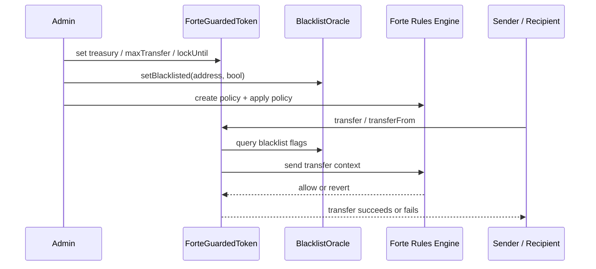

# Architecture

## Goal

Keep the ERC20 contract simple while outsourcing transfer-policy decisions to Forte Rules Engine.

---

## High-level flow

---

## Components

### `ForteGuardedToken`
Responsibilities:
- expose the ERC20 surface
- maintain local transfer context values
- pass rule inputs to Forte Rules Engine before state-changing token transfers

Key state:
- `blacklistOracle`
- `treasury`
- `maxTransfer`
- `lockUntil[address]`

Key behavior:
- `transfer()` and `transferFrom()` call the Rules Engine client path first
- treasury can bypass cap and lockup checks
- blacklist checks are delegated to `BlacklistOracle`

### `BlacklistOracle`
Responsibilities:
- store whether an account is blacklisted
- keep blacklist logic separate from the token core

Why keep it separate:
- cleaner token contract
- easier to swap data source later
- closer to a real-world compliance adapter pattern

### `RulesEngineClientCustom`
Responsibilities:
- bridge the token and Forte Rules Engine
- expose the rule-checking modifiers / call path used by the token

### `transfer-guard.policy.json`
Responsibilities:
- define the actual policy the token should obey
- let the policy evolve independently from ERC20 core code

---

## Rule model in this demo

### Rule 1: blacklist
Reject a transfer if either:
- sender blacklist flag is `1`, or
- recipient blacklist flag is `1`

### Rule 2: transfer cap
Reject a transfer if:
- sender is not the treasury, and
- `value > maxTransfer`

### Rule 3: lockup
Reject a transfer if:
- sender is not the treasury, and
- `block.timestamp < lockUntil[from]`

---

## Validation layers

### 1. Unit level
`test/ForteGuardedToken.t.sol`

Purpose:
- prove token behavior in isolation
- simulate Rules Engine behavior with `MockRulesEngine`
- get fast deterministic coverage in CI/local dev

### 2. Integration level
`scripts/rebuild-local-stack.sh`
`scripts/live-check.sh`
`scripts/integration-check.sh`
`scripts/assert-policy-state.sh`

Purpose:
- rebuild a fresh local chain
- deploy the actual local Rules Engine stack
- create and apply a real policy
- execute live transactions against deployed contracts
- assert that policy state is really attached to the token

---

## Why this architecture is stronger than hardcoding everything

### Hardcoded path
Pros:
- fewer moving parts at the start

Cons:
- policy logic grows inside the token
- every rule change becomes a contract-level edit concern
- harder to communicate what is business logic vs token plumbing

### Policy-driven path
Pros:
- cleaner ERC20 surface
- policy definition can evolve separately
- easier to extend to sanctions, KYC, allowlists, vesting, market restrictions
- better for demonstrations of compliance / controls as a system concern

Cons:
- adds integration complexity
- requires better tooling and validation discipline

This repository exists to make that tradeoff tangible.
